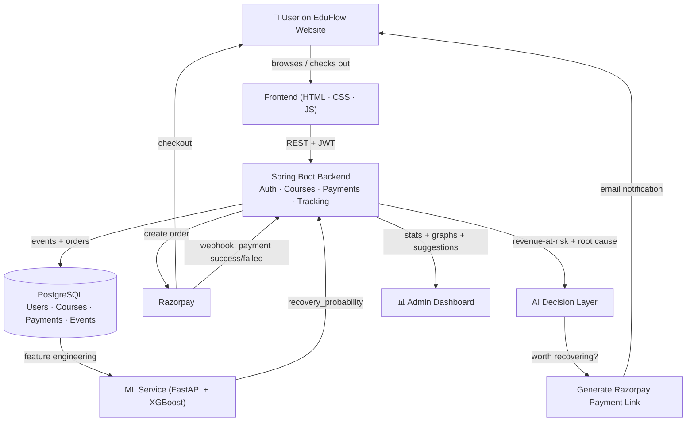

<div align="center">


<a href="#">
  
</a>

<br/>

[](#-tech-stack)
[](#-tech-stack)
[](#-tech-stack)
[](#-tech-stack)
[](#-tech-stack)
[](#-tech-stack)

[](https://github.com/UtkarshSahay123/razorpay)
[](https://github.com/UtkarshSahay123/razorpay/commits)
[](https://github.com/UtkarshSahay123/razorpay/issues)
[](https://github.com/UtkarshSahay123/razorpay/stargazers)

</div>

<br/>

## 📖 What is EduFlow?

**EduFlow** is a full-stack e‑learning platform with something most course sites don't have baked in: an **AI revenue‑recovery layer** sitting on top of the payment flow.

Instead of just processing payments and hoping people finish checkout, EduFlow **watches user behaviour end‑to‑end** — signups, course views, checkout attempts, payment failures, drop‑offs — feeds that into an **XGBoost model** to estimate the odds a stalled user still converts, and then **automatically decides** whether that user is worth chasing. If they are, EduFlow fires off a fresh **Razorpay Payment Link** by email so the user can finish paying in one click. Every result is closed back through a **Razorpay webhook** into the same dashboard that shows the founder *why* revenue is leaking and what to do about it.

> Built as a generic pattern: the abandoned‑checkout → predict → recover → notify → close‑the‑loop pipeline is not hard‑wired to courses. Swap the "course" entity for a product, a subscription plan, or a service booking and the same pipeline applies.

<br/>

## 🗺️ Table of Contents

- [What is EduFlow?](#-what-is-eduflow)
- [Security Notice](#-security-notice-read-this-first)
- [Features](#-features)
- [Architecture](#-architecture)
- [Tech Stack](#-tech-stack)
- [Project Structure](#-project-structure)
- [Getting Started](#-getting-started)
  - [Backend](#1️⃣-backend-spring-boot)
  - [ML Service](#2️⃣-ml-service-fastapi--xgboost)
  - [Frontend](#3️⃣-frontend-staticvanilla)
- [Environment Variables](#-environment-variables)
- [API Reference](#-api-reference)
- [Roadmap](#-roadmap)
- [Contributing](#-contributing)
- [License](#-license)

<br/>

## 🔐 Security Notice — read this first

> [!WARNING]
> `Backend/src/main/resources/application.properties` currently ships with **hardcoded fallback values** for the database URL/credentials, JWT secret, Razorpay keys, and Gmail app password (e.g. `${DB_PASSWORD:actual-password-here}`). Because this repo is public, those values are effectively already leaked.
>
> Before doing anything else:
> 1. **Rotate every one of those credentials** (Neon DB password, Razorpay test/live keys + webhook secret, JWT secret, Gmail app password).
> 2. Remove the hardcoded fallbacks and supply all values via environment variables / a `.env` file (already `.gitignore`d) or a secrets manager.
> 3. Consider scrubbing the old values from git history (`git filter-repo` / BFG) since rotating alone doesn't remove them from past commits.

<br/>

## ✨ Features

<table>
<tr>
<td width="50%" valign="top">

### 🎓 Course Platform (Part A)
- User registration & JWT-based login
- Course catalog & detail browsing
- Razorpay-powered checkout & enrollment
- Student dashboard with active subscriptions
- Admin auth & admin-only routes

</td>
<td width="50%" valign="top">

### 🤖 AI Revenue Recovery (Part B & C)
- Silent event tracking (views, checkout starts, failures, drop-offs)
- XGBoost model scores **recovery probability** per stalled user
- Revenue-at-risk & root-cause (network / card / abandoned) breakdown
- Auto-generated Razorpay Payment Links + email nudges
- Webhook-verified recovery closing the loop back to Postgres
- Admin analytics dashboard with charts + AI improvement suggestions

</td>
</tr>
</table>

<br/>

## 🏗️ Architecture



<br/>

## 🛠️ Tech Stack

| Layer | Technology |
|---|---|
| **Frontend** | HTML5, CSS3, vanilla JavaScript |
| **Backend API** | Java 17, Spring Boot 3.1.5, Spring Security, JWT (`jjwt`) |
| **Database** | PostgreSQL (Hibernate / Spring Data JPA) — hosted on Neon |
| **Payments** | Razorpay (Orders, Payment Links, Webhooks) — `razorpay-java` SDK |
| **ML Service** | Python, FastAPI, XGBoost, pandas, scikit-learn |
| **Email** | Spring Mail (SMTP over Gmail) |
| **Deployment** | Docker (multi-stage Maven build), Render |

<br/>

## 📁 Project Structure

```text
razorpay/
├── Backend/                      # Spring Boot REST API
│   ├── src/main/java/com/eduflow/backend/
│   │   ├── controller/           # Auth, Payment, Webhook, Dashboard, Tracking
│   │   ├── service/               # PaymentService, MlPredictionService, AiDecisionService, ...
│   │   ├── model/                 # User, Course, Enrollment, PaymentOrder, Intervention, ...
│   │   ├── repository/            # Spring Data JPA repositories
│   │   ├── dto/                   # Request/response payloads
│   │   └── security/              # JWT filter, UserDetailsService, SecurityConfig
│   ├── src/main/resources/application.properties
│   └── Dockerfile
│
├── Frontend/                     # Static site (student + admin UI)
│   ├── index.html · course.html · payment.html
│   ├── studentdashboard.html · admindash.html
│   ├── config.js                  # API base URL switch (local vs. deployed)
│   └── tracking.js                # Client-side event tracking hooks
│
├── ml_service/                   # Recovery-probability microservice
│   ├── app.py                     # FastAPI /predict endpoint
│   ├── train_model.py             # XGBoost training script
│   ├── generate_dataset.py        # Synthetic training data generator
│   └── xgboost_model.json / label_encoder.json
│
├── Antigravity_AI_Revenue_Recovery_Implementation.md   # Full implementation spec
├── Workflow for RazorPay.md                            # Original product workflow notes
└── AI_Revenue_Recovery_Agent_Complete_Workflow.docx
```

<br/>

## 🚀 Getting Started

### Prerequisites

- Java 17+ & Maven
- Python 3.9+
- A PostgreSQL database (e.g. free tier on [Neon](https://neon.tech))
- A [Razorpay](https://razorpay.com) test account (Key ID, Key Secret, Webhook Secret)
- An SMTP-capable email account (for recovery notifications)

### 1️⃣ Backend (Spring Boot)

```bash
cd Backend

# create Backend/.env or export these directly — see Environment Variables below
export DB_URL="jdbc:postgresql://<host>/<db>?sslmode=require"
export DB_USER="..."
export DB_PASSWORD="..."
export JWT_SECRET="..."
export RAZORPAY_KEY_ID="..."
export RAZORPAY_KEY_SECRET="..."
export RAZORPAY_WEBHOOK_SECRET="..."
export MAIL_USERNAME="..."
export MAIL_PASSWORD="..."
export ML_SERVICE_URL="http://localhost:8000"

mvn clean install
mvn spring-boot:run
# → API served at http://localhost:8080
```

Or with Docker:

```bash
cd Backend
docker build -t eduflow-backend .
docker run -p 8080:8080 --env-file .env eduflow-backend
```

### 2️⃣ ML Service (FastAPI + XGBoost)

```bash
cd ml_service
python -m venv venv && source venv/bin/activate   # Windows: venv\Scripts\activate
pip install -r requirements.txt

# optional — regenerate the model from scratch
python generate_dataset.py
python train_model.py

uvicorn app:app --reload --port 8000
# → Prediction endpoint at http://localhost:8000/predict
```

### 3️⃣ Frontend (static/vanilla)

```bash
cd Frontend
# API_BASE_URL in config.js auto-switches between localhost:8080 and the deployed backend
# serve with any static server, e.g.:
python -m http.server 5500
# → open http://localhost:5500/index.html
```

<br/>

## 🔑 Environment Variables

| Variable | Used by | Purpose |
|---|---|---|
| `DB_URL`, `DB_USER`, `DB_PASSWORD` | Backend | PostgreSQL connection |
| `JWT_SECRET` | Backend | Signs/validates auth tokens |
| `RAZORPAY_KEY_ID`, `RAZORPAY_KEY_SECRET` | Backend | Create orders & payment links |
| `RAZORPAY_WEBHOOK_SECRET` | Backend | Verify incoming Razorpay webhook signatures |
| `MAIL_USERNAME`, `MAIL_PASSWORD` | Backend | SMTP sender for recovery emails |
| `ML_SERVICE_URL` | Backend | Base URL of the FastAPI recovery-prediction service |

> None of these should ever be committed with real values — see the [Security Notice](#-security-notice-read-this-first).

<br/>

## 📡 API Reference

<details>
<summary><b>Auth · <code>/api/auth</code></b></summary>

| Method | Endpoint | Description |
|---|---|---|
| `POST` | `/register` | Create a new user account |
| `POST` | `/login` | Authenticate and receive a JWT |

</details>

<details>
<summary><b>Payments · <code>/api/payment</code></b></summary>

| Method | Endpoint | Description |
|---|---|---|
| `POST` | `/create-order` | Create a Razorpay order for a course |
| `POST` | `/verify` | Verify payment signature after checkout |
| `POST` | `/failed` | Record a failed payment attempt |
| `POST` | `/abandoned` | Record an abandoned checkout |

</details>

<details>
<summary><b>Webhooks · <code>/api/webhooks</code></b></summary>

| Method | Endpoint | Description |
|---|---|---|
| `POST` | `/razorpay` | Signature-verified Razorpay webhook receiver |

</details>

<details>
<summary><b>Dashboard · <code>/api/dashboard</code></b></summary>

| Method | Endpoint | Description |
|---|---|---|
| `GET` | `/student` | Student's own enrollment/activity summary |
| `GET` | `/admin` | Revenue, funnel, and recovery analytics |

</details>

<details>
<summary><b>Tracking · <code>/api/tracking</code></b></summary>

| Method | Endpoint | Description |
|---|---|---|
| `POST` | `/event` | Log a user behaviour event (view, checkout step, etc.) |

</details>

<details>
<summary><b>ML Service · <code>/predict</code></b></summary>

| Method | Endpoint | Description |
|---|---|---|
| `POST` | `/predict` | Returns `recovery_probability` for a user given their behaviour features |

</details>

<br/>

## 🧭 Roadmap

- [ ] Move all secrets out of `application.properties` into env-only config
- [ ] Add automated tests (backend + ML service)
- [ ] SMS/WhatsApp recovery channel alongside email
- [ ] Model versioning + retraining pipeline
- [ ] Multi-tenant support so any business can plug in its own funnel

<br/>

## 🤝 Contributing

Contributions, issues, and feature requests are welcome!

```bash
# Fork, then:
git checkout -b feature/your-feature
git commit -m "Add: your feature"
git push origin feature/your-feature
# then open a Pull Request
```

<br/>

## 📄 License

No license file is currently included in this repository. Until one is added, all rights are reserved by the author — add a [`LICENSE`](https://choosealicense.com/) file if you intend this project to be reused by others.

<br/>

<div align="center">

⭐ **If EduFlow's recovery pipeline is useful to you, consider starring the repo!** ⭐


</div>
